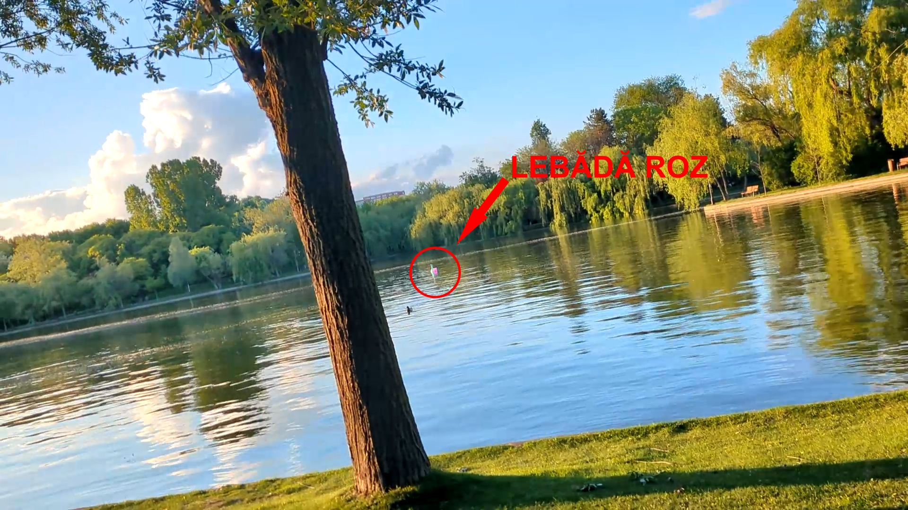

# Despre parcul IOR

<iframe width="560" height="315" src="https://www.youtube.com/embed/5-EvCMq6bnk?si=ZQoK0HjaQps80-0W" title="YouTube video player" frameborder="0" allow="accelerometer; autoplay; clipboard-write; encrypted-media; gyroscope; picture-in-picture; web-share" referrerpolicy="strict-origin-when-cross-origin" allowfullscreen></iframe>

Parcul IOR din București este unul dintre cele mai populare parcuri din oraș, oferind o oază de relaxare și recreere pentru locuitorii din zonă. Acesta se întinde pe o suprafață generoasă și este împărțit în mai multe zone distincte. În mijlocul parcului se află un lac artificial, în jurul căruia se desfășoară alei pitorești, perfecte pentru plimbări sau alergări. În plus, parcul oferă numeroase facilități de agrement, cum ar fi terenuri de sport, locuri de joacă pentru copii, zone de picnic și chiar terase sau cafenele în aer liber. Pe tot parcursul anului, parcul găzduiește diverse evenimente culturale, concerte sau festivaluri, atrăgând astfel atât localnicii, cât și turiștii. Este un loc ideal pentru a scăpa de agitația orașului și a te bucura de natură în mijlocul Bucureștiului.

